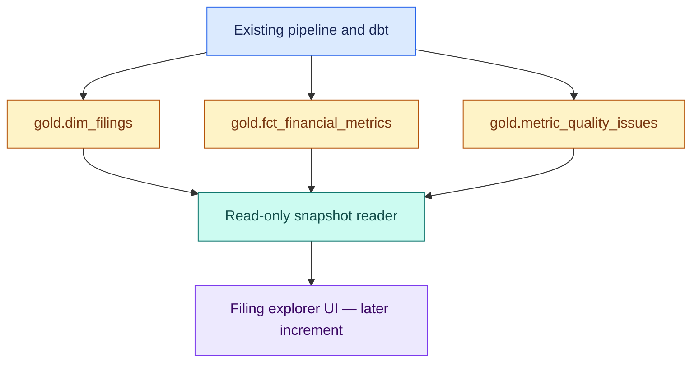

# SEC filing explorer — dashboard V1

## Purpose

The first screen answers three questions: which filing am I looking at, what did it report, and where did that number come from? Missing data and derivation warnings belong beside the financial results. V1 is a local, read-only filing explorer. It retains accession-level history and the financial rules already implemented in dbt. The first implementation adds the reader and a command-line inspector. The browser interface follows as a separate increment on the same foundation.

## Design decisions

| Decision | Reason |
| --- | --- |
| Read the three existing Gold marts | They already own financial selection, coverage, quality, and lineage. |
| Keep a small Python reader between the database and UI | The data contract can be tested without a browser framework. |
| Use Streamlit for the later local interface | The project already uses Python and needs a compact interactive explorer. |
| Keep the UI dependency optional | Ingestion and other package imports should work without the dashboard installed. |
| Select by CIK and accession | Company identity and filing identity stay explicit. |
| Preserve each exact period and value origin | Annual, quarter, year-to-date, instant, and derived values mean different things. |
| Run readers and pipeline writers separately | V1 keeps its existing local, single-writer operating model. |

Streamlit will be added in the UI increment through an optional `dashboard` dependency group. The reader requires only dependencies already in the project. A public deployment needs its own portable data arrangement and release process; the local interface does not establish that deployment design.

## Data flow



The reader queries the three relations separately within one transaction. It does not join metric rows to issue rows. That keeps several metrics and several warnings from multiplying one another in the displayed data.

## Existing sources

| Relation | What the dashboard receives |
| --- | --- |
| `gold.dim_filings` | One summary per active CIK/accession, with form, filing/report dates, fiscal focus, source identity, coverage counts, quality status, and missing critical metrics. |
| `gold.fct_financial_metrics` | Exact selected or derived values, units, periods, origin labels, rules, and current/predecessor evidence. |
| `gold.metric_quality_issues` | Every existing issue occurrence, including its severity, stage, details, and ordered evidence arrays. |

Their current contracts have 40, 40, and 17 columns respectively. SQL models and `transform/models/properties.yml` remain the authority for the ordered columns and types. The reader uses explicit projections for those contracts.

Company names and tickers are not present in these three marts. The initial selector therefore lists normalized CIKs. It does not infer names from filenames, invent tickers, or call SEC endpoints to decorate the screen. Friendly names need a separate stored metadata decision if they are added later. Filings with Gold `PARTIAL` or `FAILED` status stay visible. A filing with no selected financial values still has a useful summary explaining the gap.

## First implementation: reader contract

The package exposes:

```python
load_dashboard_snapshot(
    *,
    database_path: Path,
    cik: str | None = None,
    accession_number: str | None = None,
) -> DashboardSnapshot
```

`DashboardReadError` represents invalid reader inputs, unusable database paths, missing/incompatible required Gold columns, or DuckDB read failures.

The returned objects are frozen, slotted dataclasses:

```text
DashboardTable
    columns: tuple[str, ...]
    column_types: tuple[str, ...]
    rows: tuple[tuple[object, ...], ...]

DashboardSnapshot
    database_path: Path
    available_ciks: tuple[str, ...]
    cik: str | None
    accession_number: str | None
    filings: DashboardTable
    financial_metrics: DashboardTable
    quality_issues: DashboardTable
```

`database_path` is canonical. Selected CIKs use the existing normalization rules. An accession filter requires a CIK and uses the existing `FilingReference` validation. Accession prefixes are not treated as the issuer CIK; the accepted Microsoft filings demonstrate why that distinction matters.

`available_ciks` is the sorted distinct list from the entire `gold.dim_filings` relation, even when the returned tables are filtered. With no filters, the three tables contain all rows. A CIK filters all three by company. A CIK plus accession filters all three by filing. A valid filter with no matches returns empty typed tables.

All projected columns retain their existing names, order, and SQL types. An empty result still carries its column names and types. Missing required fields or incompatible types produce a clear error. Additional upstream columns can remain outside the explicit projection. DuckDB's `TIMESTAMP WITH TIME ZONE` spelling is treated as equivalent to `TIMESTAMPTZ` when checking the declared contract.

Financial values remain Python `Decimal`; dates, timezone-aware timestamps, booleans, integers, strings, and nulls retain their native meanings. DuckDB list values become tuples in the snapshot so the returned evidence arrays are immutable. Their order, empty state, and null state are preserved. Rows and issue occurrences are never deduplicated.

Filing rows sort by CIK ascending, filing date descending with nulls last, then accession descending. Metric and issue tables use deterministic full-record ordering. Ordering is for display and reproducible inspection; it does not select a preferred value or a latest filing.

## Read lifecycle

Each call validates its arguments, resolves an existing regular database file, and opens a dedicated connection with `read_only=True`. It starts one explicit transaction, obtains the global CIK list and the three projected datasets, materializes the immutable snapshot, and closes the connection before returning. Error paths also close the connection.

The database must already exist. A mistaken path cannot create an empty database. Queries use fixed relation names and bound parameters for filter values. The API accepts no arbitrary SQL, relation names, or filesystem destinations.

The reader creates no schema, view, table, metadata row, export, or run record. It initiates no ingestion, catalog refresh, metadata load, dbt build, or SEC request. It uses no global connection or connection cache.

DuckDB's transaction provides a consistent database read. It does not make external Parquet files, dbt publication, and filesystem evidence part of one atomic snapshot. The operating rule remains simple: stop the dashboard or other database readers before pipeline writes, then reopen the explorer after execution finishes. V1 adds no concurrent-writer guarantee or locking service.

## Command-line inspection

The first increment includes a small inspector:

```bash
uv run --locked python -m sec_edgar_lakehouse.dashboard_inspect \
  --database /absolute/path/to/sec_edgar.duckdb
```

Optional `--cik` and `--accession-number` flags use the reader's selection rules. Output identifies the canonical database, available CIKs, requested scope, all three row counts, and a small financial sample with exact decimal text, period label, origin, and units. It does not label a successful read as financially complete.

Exit code 0 means the read succeeded, including an empty selection. Invalid invocation or an expected read error returns 1. The command prints output only; it does not save another copy of the data.

## Planned interface

### Filing browser

A company selector and filing table provide the starting point. Each filing shows its accession, form, filing date, report date, fiscal year/focus, Gold quality status, and warning/error counts. The user chooses a filing explicitly; amendments remain separate accessions.

The selected database path and available coverage are visible. A small historical selection is not presented as full-company or full-year coverage.

### Financial metrics and lineage

The selected filing's metrics are grouped by their existing period labels. Each row shows the metric, exact period, value, unit, and reported/derived origin. A selected row exposes its source document, checksum, occurrence IDs, supporting IDs, and rule versions.

Derived rows also expose both input values and the predecessor accession/document. The UI displays the stored derivation method rather than recalculating it.

A metric card needs an explicitly selected exact period. If more than one eligible period is present, the interface asks the user to choose one rather than taking the first row. Missing values remain unavailable; they are not replaced with zero.

### Quality details

A separate section shows the selected filing's existing issue rows, including stage, severity, code, details, and current/predecessor evidence. Repeated issue rows remain repeated.

The interface uses `gold_quality_status` and `gold_quality_reason` from the filing summary. A complete filing can still carry warnings. Pipeline execution status and dbt success are different concepts and are not inferred from these marts.

## Financial presentation rules

- Annual values come from the selected annual filing; the dashboard does not sum four filings to create an annual total.
- Quarter and year-to-date values stay separate. They are never added together.
- Instant balances retain their observation date and are not summed across quarters.
- Derived quarters remain visibly derived and keep both input lineages.
- EPS retains its USD/share unit and is never derived by subtracting cumulative EPS.
- Accession-level repeated periods remain separate. The dashboard does not resolve amendments, restatements, or a latest-value policy.
- Display formatting may abbreviate a value, but the exact decimal remains available. The reader performs no rounding or float conversion.

The first UI is a filing explorer. Cross-filing trend charts, ratios, year-over-year calculations, and company comparisons need separate rules and are outside this first design.

## Errors, availability, and deployment boundary

Missing databases, unavailable required marts, incompatible projected schemas, broken referenced source files, and file-lock conflicts produce useful read errors. The UI can explain the problem and let the operator correct the input or finish a pipeline run. It does not repair the database automatically.

A valid empty dataset or unmatched filter is a normal empty state. Gold quality problems are displayed as data, not converted into reader errors.

Current Silver external views retain absolute local Parquet paths. Copying the DuckDB file alone does not create a portable deployment. Packaging a reproducible demo dataset, hosting, authentication, scheduled refreshes, and concurrent serving are later decisions. The local reader is not an arbitrary database-upload service.

## Validation

Focused tests exercise this boundary with temporary DuckDB databases: multi-company and filing isolation, complete projected schemas, typed empty results, exact decimals, null/date/timestamp handling, ordered evidence arrays, repeated issues, visible failed/partial filing summaries, and clear input/schema/read errors. They also verify that reads leave existing database bytes unchanged and that a missing path creates nothing.

Post-review local acceptance reads the existing shared Apple/Microsoft dataset. It compares every returned record against direct read-only projections, checks filtered results, and confirms the database checksum is unchanged. Counts are observed acceptance results, not company-specific constants in automated tests.

The first increment is complete when the reader and inspector can expose the existing marts accurately without modifying their source. Browser implementation follows after that contract is accepted.

