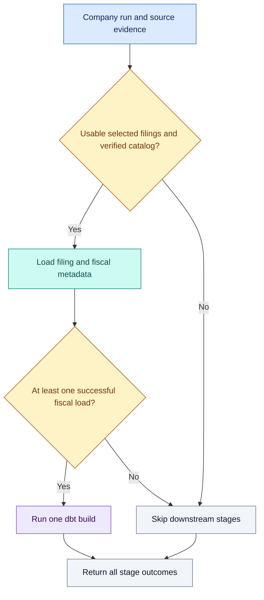

# End-to-end company pipeline — V1

## Why this layer exists

The project now has the pieces needed to get from an SEC filing to queryable financial metrics. A company run discovers and processes filings, publishes Bronze and Silver, refreshes the DuckDB catalog, and preserves its source evidence. Separate loaders add filing and fiscal metadata. A dbt runner builds Gold and keeps the execution artifacts.

Those pieces have been tested separately. The remaining gap is the handoff between them. Running each one manually makes it easy to use the wrong database, forget metadata loading, or rebuild Gold after a failed catalog refresh.

This design introduces one Python entry point that connects the existing stages. Its job is to decide what can run next and explain what happened. Downloads, extraction, metadata validation, and financial calculations stay with the components that already own them.

This is the proposed design for the next integration increment. The existing company-pipeline and Gold documents continue to describe their own layers.

## The first increment

The first implementation is a reusable API, `run_end_to_end_pipeline()`. It processes one company and returns an immutable result containing the individual stage outcomes.

It adds three things:

- A consistent order for the existing stages.
- Explicit conditions for starting metadata loading and dbt.
- A final execution status that retains the earlier results and available evidence.

A command-line entry point and a persisted end-to-end summary can follow in a separate increment. This first slice does not add either of them. Keeping that boundary small lets us verify the workflow before adding another record format.

## Workflow

The metadata gate also requires the metadata coordinator to return `COMPLETE` or `PARTIAL`. A successful fiscal load means `INSERTED` or `ALREADY_EXISTS`, with extraction status `COMPLETE` or `PARTIAL`. A partial extraction can retain useful fields and evidence even when another field is unresolved.

Each stage runs at most once per invocation. There is no outer retry loop around the whole pipeline.

## Responsibilities

| Component | Responsibility |
| --- | --- |
| `execute_company_pipeline_run()` | Company discovery and selection, sequential Bronze/Silver processing, one catalog refresh when eligible, and immutable company-run evidence. |
| `load_company_run_metadata()` | One filing-metadata load, followed by fiscal-metadata loading for usable selected filings. Existing loaders verify and store the evidence. |
| `run_dbt_build()` | One subprocess build against the explicit DuckDB database, with retained logs and verified dbt artifacts. |
| `run_end_to_end_pipeline()` | Argument handoff, stage eligibility, expected failure handling, and the combined execution result. |
| dbt models | Financial selection, period classification, supported derivations, financial marts, and data-quality relations. |

The wrapper does not copy financial rules into Python or repeat the existing checksum, XML, publication, or database validations.

## Inputs and database identity

The entry point keeps the existing company-run inputs: CIK, exact forms, optional filing-date boundaries and limit, User-Agent, source locations, run ID, optional HTTP client, and request interval.

It also receives the dbt project directory, profiles directory, a fresh artifact directory, and a build timeout. These locations are explicit so execution does not depend on the terminal's current directory.

The same canonical database path passes through catalog refresh, metadata loading, and dbt. The dbt runner supplies that path to its subprocess through `SEC_EDGAR_DUCKDB_PATH` without changing the parent process environment.

Wrapper-owned arguments are checked before starting company processing. That includes path types, project/profile configuration files, a finite positive timeout, and an unused artifact destination with an existing parent. Validation does not create the dbt artifact directory.

The database does not have to exist before the company stage. A first successful catalog refresh can create it. The dbt runner requires an existing database when its own stage starts.

The optional dbt installation remains a runtime requirement for a build. Importing the lakehouse package does not require dbt. Existing components remain responsible for validating their own inputs and managing an injected HTTP client's ownership.

## When a stage can run

### Company run

The company stage runs once using the existing API. It retains deterministic selection, shared request pacing, bounded request retries, and the current handling of SEC terminal conditions.

An empty selection is a successful no-op. Metadata loading and dbt are skipped, even if the database already contains data from an older run.

### Metadata loading

Metadata loading starts only when the returned company run contains a pipeline result, at least one usable selected filing, and a catalog refresh with status `COMPLETE` or `PARTIAL`.

Usable filing outcomes remain `COMPLETE`, `PARTIAL`, and `SKIPPED`. A verified existing filing is useful input, even when this invocation did not publish another version.

A failed catalog refresh blocks metadata and dbt. The existence of an older database snapshot does not authorize downstream execution for this run.

The metadata coordinator loads filing metadata for the company's active catalog filings. It then loads fiscal metadata for the usable selected filings in processing order. Missing or conflicting filing metadata blocks the affected fiscal load. Other eligible filings can continue under the existing coordinator policy.

### Gold build

The dbt stage starts only after a metadata result of `COMPLETE` or `PARTIAL`, with at least one successful fiscal load. `FAILED` or `SKIPPED` metadata blocks the build.

A partial metadata result can still produce useful Gold rows and visible quality issues. The wrapper keeps that partial status rather than treating a successful dbt build as proof that the earlier gap disappeared.

The build runs the existing dbt project once. It does not introduce a model-selection filter, new financial calculations, or a second catalog refresh.

## Execution status and financial quality

The combined result uses `COMPLETE`, `PARTIAL`, and `FAILED`. Individual metadata and dbt stages can also be `SKIPPED`, with a reason.

| Situation | Combined status | Downstream behavior |
| --- | --- | --- |
| Company run completes with no selected filings | `COMPLETE` | Metadata and dbt are skipped. |
| Company, metadata, and dbt all complete | `COMPLETE` | All stages ran successfully. |
| Company or metadata is partial, and dbt completes | `PARTIAL` | Useful results are retained with their earlier issues. |
| Usable selected Silver exists, but catalog refresh fails | `PARTIAL` | Metadata and dbt are skipped. |
| Usable selected Silver exists, but metadata fails or has no successful fiscal load | `PARTIAL` | dbt is skipped. |
| Usable selected Silver exists, but dbt fails | `PARTIAL` | Earlier outputs and available build evidence are retained. |
| Selected filings produce no usable Silver, or discovery fails | `FAILED` | Metadata and dbt are skipped. |
| Company-run evidence cannot be finalized and no company result is returned | `FAILED` | Downstream execution stops. Earlier data outputs may still exist. |

`PARTIAL` describes retained useful progress, not a successful Gold delivery. A caller checking whether Gold built successfully reads the dbt stage status as well as the combined status.

These are execution outcomes. Financial quality remains in `gold.dim_filings` and `gold.metric_quality_issues`. A successful build can expose a filing with incomplete financial information. It can also expose a complete filing with supplemental warnings. The wrapper does not calculate or overwrite those business-quality statuses.

## Result and error handling

The result retains the original `CompanyRunResult`, `CompanyMetadataLoadResult`, and `DbtBuildResult` objects when available. It also exposes the combined status, stage statuses, skip reasons, and expected execution errors. A missing result stays absent rather than being replaced by a made-up success object.

Invalid wrapper inputs raise a dedicated input error before execution. Expected stage failures are associated with the stage that failed. An exception from company-run evidence publication stops the workflow. Expected metadata or dbt launch/filesystem failures preserve the earlier stage results and any artifact path supplied by the failing component.

A nonzero dbt exit, timeout, or invalid execution artifacts remain a failed dbt result under the existing runner contract. Unexpected programming exceptions propagate so they remain visible during development.

The wrapper leaves `run.json` unchanged. Its company status describes company processing and catalog refresh, not the later metadata and Gold stages.

## Evidence and local storage

All local data and run evidence remain under the ignored `data/` directory. These are example locations, not hard-coded API requirements.

| Location | Contents |
| --- | --- |
| `data/bronze/sec/filings/` | Published SEC source files, discovery evidence, and Bronze manifests. |
| `data/silver/sec/filings/` | Versioned Parquet, publication metadata, active pointers, and Silver run records. |
| `data/query/sec_edgar.duckdb` | Catalog metadata, external Silver views, stored filing/fiscal metadata, and dbt-managed Gold relations. |
| `data/runs/company/cik=<cik>/run_id=<run-id>/` | Immutable `run.json` and exact `submissions.json` when discovery evidence is available. |
| `data/runs/dbt/run_id=<run-id>/` | A fresh build's `stdout.log`, `stderr.log`, and dbt `target/` and `logs/` artifacts when produced. |

The company record and dbt invocation ID serve different purposes. The result connects them by retaining the company run ID and the exact build result. They do not need to share an identifier.

The first integration slice returns this connection in memory. It does not promise a durable combined summary or an in-progress recovery record. A later CLI/evidence increment can persist references to the existing evidence without changing it or copying the source facts.

## Publication, failure, and reruns

There is no single transaction covering SEC requests, source files, Parquet, metadata tables, and dbt. Each component keeps its existing publication or transaction boundary.

Bronze and Silver can remain published if a later stage fails. Metadata transactions that completed also remain stored. A failed dbt build may have replaced some Gold relations before another model or test failed. Version 1 does not provide atomic Gold publication or restore an earlier complete Gold snapshot.

Execution stays local and sequential with one writer. Python database connections are closed before the dbt subprocess opens the database. The DuckDB UI is closed while a pipeline run writes to that database. This design adds no locks or concurrent-writer guarantees.

A rerun uses a new company run ID and a fresh dbt artifact directory. The existing components decide what can be reused:

- Verified equivalent Bronze and Silver data can be reused without duplicate canonical facts.
- Matching metadata returns `ALREADY_EXISTS` and preserves its original provenance.
- dbt runs again for an eligible rerun, producing new execution evidence.
- Original company records and earlier dbt artifacts remain unchanged.

Retries of individual SEC requests stay in the existing request layer. The wrapper does not automatically replay a failed end-to-end invocation or delete retained failure evidence.

## Scope of the Gold build

The company stage selects filings for one company. Catalog refresh and dbt have a wider scope: the catalog exposes verified active Silver versions across its root, and the project builds Gold from that catalog.

The wrapper therefore does not claim that a build contains only the current selection. Previously loaded filings remain available. Metadata loading does not automatically backfill fiscal metadata for every company in the database. Existing Gold models and issue views expose missing information where their rules apply.

This also leaves accession-level history intact. The wrapper does not choose a latest filing, reconcile amendments, or remove repeated periods across different accessions. Those are separate business decisions for a later trend or dashboard layer.

## Verification for this increment

Focused coordinator tests cover call order, argument forwarding, one call per eligible stage, empty selection, blocked downstream stages, partial results, expected failures, and propagation of unexpected exceptions. They also confirm that the original result objects are preserved and a first run can create the catalog database.

The existing components already test request handling, parsing, metadata integrity, financial rules, and dbt artifacts. The coordinator tests exercise the handoffs rather than repeating those suites.

Local acceptance uses a bounded selection and explicit paths. It checks the company record, metadata outcomes, dbt invocation evidence, and the three final Gold relations: `fct_financial_metrics`, `dim_filings`, and `metric_quality_issues`. A second run verifies safe source reuse and unchanged prior evidence. Acceptance row counts come from the loaded data rather than an Apple-specific assertion embedded in the coordinator.

The increment is ready when an eligible invocation reaches Gold without manual handoffs, an ineligible invocation skips the right stages, and every expected failure retains an honest outcome and available evidence.

## What comes later

The next slice can add a thin CLI and a final end-to-end evidence record. A dashboard, broader company acceptance, deployment, and scheduling remain separate work. Version 1 does not add Airflow, Spark, Kafka, cloud storage, or a warehouse migration as part of this integration.

The useful outcome here is a repeatable local pipeline with clear boundaries. Additional infrastructure can follow a measured need without changing the financial rules just to accommodate another tool.
